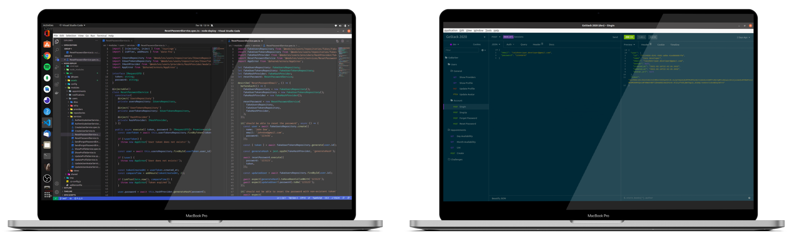

<h1 align="center">
  <a href="https://gobarber.desenvolvendosistemas.dev.br">
    
  </a>
</h1>

<h5 align="center">
  💈 GoBarber api, a project developed to offer barber shop scheduling.
</h5>

<p align="center">
  <!-- <a href="#art-app-ui">🎨 App UI</a>&nbsp;&nbsp;&nbsp;&nbsp;|&nbsp;&nbsp;&nbsp; -->
  <a href="#flying_saucer-technologies">🛸 Technologies</a>&nbsp;&nbsp;&nbsp;&nbsp;|&nbsp;&nbsp;&nbsp;
  <a href="#warning-prerequisites">⚠️ Prerequisites</a>&nbsp;&nbsp;&nbsp;&nbsp;|&nbsp;&nbsp;
  <a href="#grey_question-how-to-use">❔ How To Use</a>&nbsp;&nbsp;&nbsp;&nbsp;|&nbsp;&nbsp;&nbsp;
  <a href="#bookmark-badges">🔖 Badges</a>&nbsp;&nbsp;&nbsp;&nbsp;|&nbsp;&nbsp;&nbsp;
  <a href="#closed_lock_with_key-license">🔐 License</a>
</p>

<!-- <br> -->

<!-- ## :art: App UI -->

<br>

<p align="center">
  
</p>

## :flying_saucer: Technologies

This project was developed at the [RocketSeat GoStack Bootcamp 11](https://rocketseat.com.br) with the following technologies:

-  [AWS SDK](https://github.com/aws/aws-sdk-js)
-  [Bcrypt.js](https://github.com/dcodeIO/bcrypt.js)
-  [Cors](https://github.com/expressjs/cors)
-  [Celebrate](https://github.com/arb/celebrate)
-  [Date-fns](https://date-fns.org/)
-  [Express](https://expressjs.com/)
-  [Handlebars](https://handlebarsjs.com/)
-  [Jest](https://jestjs.io/)
-  [JSON Web Tokens - JWT](https://jwt.io/)
-  [MongoDB](https://github.com/mongodb/node-mongodb-native)
-  [Multer](https://github.com/expressjs/multer)
-  [NodeJS][nodejs]
-  [Nodemailer](https://nodemailer.com/about/)
-  [Redis](https://redis.io/)
-  [TypeORM](https://typeorm.io/#/)
-  [TSyringe](https://github.com/Microsoft/tsyringe)
-  [TypeScript](https://www.typescriptlang.org/)
-  [Uuidv4](https://www.npmjs.com/package/uuidv4)
-  [VS Code][vc] with [ESLint][vceslint], [EditorConfig][vceditconfig] & [Prettier][vcprettier]

## :warning: Prerequisites

In order to use and test this project locally, you should've already setup the development environment. <br>
Therefore, firstly i recommend that you install [Docker](https://www.docker.com/) on your machine and download the images [postgres](https://hub.docker.com/_/postgres), [mongo](https://hub.docker.com/_/mongo) and [redis](https://hub.docker.com/_/redis/) following the steps in the section on the page **How to use this image**. _Or you can also just follow the steps in the "<a href="#grey_question-how-to-use">❔ How To Use</a>" section of this doc._ <br>
_Or go to [**gobarber.desenvolvendosistemas.dev.br**](https://gobarber.desenvolvendosistemas.dev.br/) to see the project in a production environment._

-	Insomnia request routes: <br>
[](https://insomnia.rest/run/?label=GoBarber%20API&uri=https%3A%2F%2Fgithub.com%2Fcaiohenrique-developer%2Fnode-deploy%2Fblob%2Fmaster%2F.github%2Fworkflows%2Fdocs%2FGoBarber%2520API%2520-%2520Insomnia_2021-02-18)

## :grey_question: How To Use

To clone and run this application locally, you'll need [Git](https://git-scm.com), [Node.js v10.16][nodejs] or higher + [Yarn v1.13][yarn] or higher installed on your computer.

<details open>
  <summary>Hit me to toggle collapse: 🕹️🤏</summary>

  _From your `command line` follow these steps..._

  ```bash
	# Clone the project
	$ git clone https://github.com/caiohenrique-developer/node-deploy 'GoBarber API' && cd 'GoBarber API'

	# Install dependencies
	$ yarn
	# or
	$ npm i

	# Install PostgreSQL image
	# Maybe you must be use the sudo command
	$ docker run --name your-container-name \
			-e POSTGRES_USER=your-username \
			-e POSTGRES_DB=your-database \
			-e POSTGRES_PASSWORD=your-secret-password \
			-p 5432:5432 \
			-d postgres

	# Install MongoDB image
	$ docker run --name your-container-name -p 27017:27017 -d -t mongo

	# Install Redis image
	$ docker run --name your-container-name -p 6379:6379 -d -t redis:alpine

	# Copy the files
	# Replace in the (..._TYPE, ..._HOST, ..._PORT, ..._USER, ..._PASS, ..._DB) variables with the values of the images you downloaded for the Postgres, Mongo and Redis containers, on .env file generated
	$ cp .env.example .env && cp ormconfig.example.js ormconfig.js

	# Run the migrations in order to create the database schema
	$ yarn typeorm migration:run

	# Start the project
	$ yarn dev:server

	# Very well, now you can enjoy this project ;)
  ```

  + <details>
      <summary>See also: 🕹️🤏</summary>

      #### WEB

      <a href="https://github.com/caiohenrique-developer/react-deploy">
        
      </a>

      #### MOB

      <a href="https://github.com/caiohenrique-developer/react-native-deploy">
        
      </a>
    </details>
</details>

<p align="center">
  
</p>

## :bookmark: Badges

<p align="center">
  

  

  <a href="https://www.codacy.com/app/caiohenrique-developer/node-deploy?utm_source=github.com&amp;utm_medium=referral&amp;utm_content=caiohenrique-developer/node-deploy&amp;utm_campaign=Badge_Grade">
    
  </a>

  <a href="https://github.com/caiohenrique-developer/node-deploy/commits/master">
    
  </a>

  <a href="https://github.com/caiohenrique-developer/node-deploy/releases">
    
  </a>

  <br>

  <a href="https://github.com/caiohenrique-developer/node-deploy/tags">
    
  </a>

  <a href="https://github.com/caiohenrique-developer/node-deploy/issues">
    
  </a>

  

  

  <!-- <a href="https://app.netlify.com/sites/gobarber-react-web/deploys">
    
  </a> -->
</p>

## :closed_lock_with_key: License
This project is under the MIT license. See the [LICENSE](https://github.com/caiohenrique-developer/node-deploy/blob/master/LICENSE) for more information.

---
<blockquote align="center">Done with ♥ by myself ☝️ <a href="https://www.linkedin.com/in/caio-henrique-024627171/">Get in touch!</a></blockquote>

[nodejs]: https://nodejs.org/
[yarn]: https://yarnpkg.com/
[vc]: https://code.visualstudio.com/
[vceditconfig]: https://marketplace.visualstudio.com/items?itemName=EditorConfig.EditorConfig
[vceslint]: https://marketplace.visualstudio.com/items?itemName=dbaeumer.vscode-eslint
[vcprettier]: https://prettier.io/
